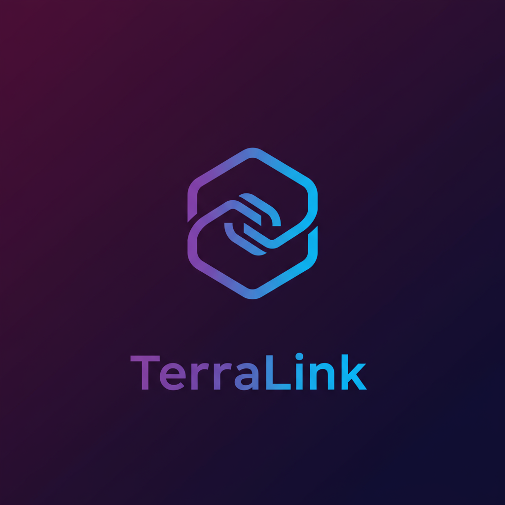

# Terralink



[](https://goreportcard.com/report/github.com/segator/terralink)
[](https://github.com/segator/terralink/actions/workflows/main.yml)
[](https://github.com/segator/terralink/releases/latest)
[](https://github.com/segator/terralink/blob/main/LICENSE)
[](https://github.com/segator/terralink)


**Tired of manually changing your Terraform module sources to local paths during development?**

Terralink is a command-line tool that simplifies this process, allowing you to seamlessly switch between remote and local module dependencies.

By adding a simple comment directive to your module blocks, you can instruct Terralink to "load" your local modules for development or "unload" them to revert to the original remote sources. This is especially useful for developers who need to frequently test changes locally without altering their main Terraform configuration.
## Installation

### Go Install
If you have Go installed, you can easily install Terralink using the following command:
```bash
go install github.com/segator/terralink@v0.2.0  # x-release-please-version 
```

### Pre-built Binaries
You can download pre-built binaries for various platforms from the [releases page](

#### Linux AMD64 processors
```bash
https://github.com/segator/terralink/releases/download/v0.2.0/terralink-0.2.0-linux-amd64  # x-release-please-version 
```

#### Linux ARM processors
```bash
https://github.com/segator/terralink/releases/download/v0.2.0/terralink-0.2.0-linux-arm64  # x-release-please-version
```

#### MacOS ARM processors
```bash
https://github.com/segator/terralink/releases/download/v0.2.0/terralink-0.2.0-darwin-arm64  # x-release-please-version
```

#### MacOS Intel processors
```bash
https://github.com/segator/terralink/releases/download/v0.2.0/terralink-0.2.0-darwin-amd64  # x-release-please-version
```

### Nix
You can run Terralink directly using `nix run`, which will build and execute it without adding it to your profile. This is useful for one-off commands.
```bash
nix run github:segator/terralink/v0.2.0#terralink version # x-release-please-version
```

### DevBox
Run `devbox init` then add Terralink to your Devbox environment

```bash
devbox add github:segator/terralink/v0.2.0#terralink # x-release-please-version
```

After adding the package, run `devbox shell`. The terralink command will be available in your shell.

## Usage

To use Terralink, first add a special comment directive to your Terraform module blocks. This directive tells Terralink where to find the local version of the module.
The format for the directive is: 

```hcl
# terralink: path=/path/to/your/local/module
```

Example:
```hcl
module "aws_managed" {
    # terralink: path=../local/aws/managed
    source  = "my-registry/managed/aws"
    version = "1.2.3"
    
    # ... other module configurations
}
```
you can ignore certain paths from being scanned by `.terralinkignore` file:
```
.terraform
environments/prod/
node_modules/
```

the file is expected in the working directory where you run the Terralink commands.


Once your directives are in place, you can use the following commands to manage your module dependencies.

### Load Local Modules

This command scans a directory for Terralink directives and modifies the source attribute of the corresponding modules to point to the local path.
```bash
terralink load --dir=/path/to/your/terraform/project
```

### Unload Local Modules

This command reverts the changes made by load, restoring the original remote source for the modules.
```bash
terralink unload --dir=/path/to/your/terraform/project
```

### Check Module Status

This command checks the status of your modules and exits with a non-zero status code if any local modules are currently loaded. This is perfect for integrating into your CI/CD pipeline or Git hooks to prevent committing local development configurations.
```bash
terralink check --dir=/path/to/your/terraform/project
```

Pro-Tip: Add the check command to a pre-commit Git hook or your CI pipeline to ensure you don't accidentally commit code with local module paths.
